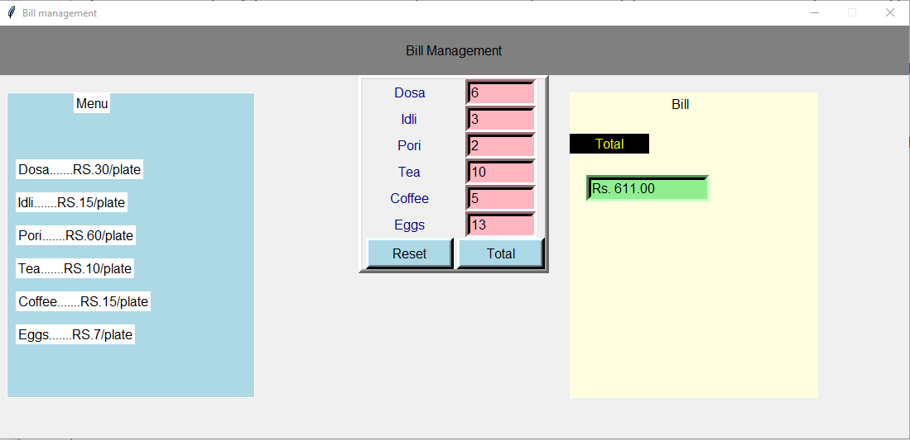

<h1>Money management</h1>
<h3>project summary</h3>

  This application is used to calculate the totel ammount of the products on the code

  This Python tkinter program creates a basic bill management system that allows users to enter quantities for items like dosa, idli, tea, and coffee and then calculates the total bill. The interface includes a menu display with item names and prices, input fields for quantities, and buttons to either calculate the total or reset the form. The Total function multiplies each item's quantity by its unit price to determine the cost, sums all costs for a grand total, and displays it in a dedicated section. The Reset function clears all input fields, making it easy to start a new bill.
</h3>
